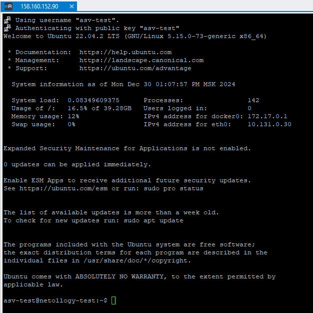

# Домашнее задание к занятию "`Введение в виртуализацию`" - `Дедюрин Денис`

---
## Задание 1
Ознакомьтесь с инструкцией по экономии облачных ресурсов.

- Создайте через web-интерфейс Yandex Cloud - VPC и виртуальную машину из инструкции конфигурации "эконом-ВМ" с публичным ip-адресом. В пункте "Выбор образа/загрузочного диска" выберите вкладку "Cloud Marketplace" , щелкните "Посмотреть больше", найдите образ "Yandex Cloud Toolbox".
- Убедитесь, что вы можете подключиться к консоли ВМ через ssh, используя публичный ip-адрес. Убедитесь, что на ВМ установлен Docker с помощью команды docker --version(команду выполните от имени root пользователя) !
- Узнайте в инструкции Яндекс, какие еще инструменты предустановлены в данном образе.
- Оставьте ВМ работать, пока она не выключится самостоятельно! Опция "прерываемая" выключит ее не позже чем через 24 часа.
- Для наглядности подождите еще 1 сутки.
- Перейдите по ссылке . Выберите свой платежный аккаунт. Перейдите на вкладку детализация (фильтр "По продуктам") и оцените график потребления финансов.
- Удалите ВМ или пользуйтесь ею при выполнении последующих домашних заданий курса обучения.

### Ответ:
Создаем виртуальную машину по эконом варианту:

Пробуем к ней подключиться по ssh.

---
## Задание 2
Выберите один из вариантов платформы в зависимости от задачи. Здесь нет однозначно верного ответа так как все зависит от конкретных условий: финансирование, компетенции специалистов, удобство использования, надежность, требования ИБ и законодательства, фазы луны.

Тип платформы:

- физические сервера;
- паравиртуализация;
- виртуализация уровня ОС;

Задачи:

- высоконагруженная база данных MySql, критичная к отказу;
- различные web-приложения;
- Windows-системы для использования бухгалтерским отделом;
- системы, выполняющие высокопроизводительные расчёты на GPU.
- Объясните критерии выбора платформы в каждом случае.

### Ответ:

Для каждой задачи наиболее подходящая платформа будет следующей:

**1. Высоконагруженная база данных MySQL, критичная к отказу**
- **Платформа:** Физические сервера
- **Обоснование:** Для базы данных, критичной к отказу, необходима высокая надежность и минимальная вероятность отказа. Физические серверы обеспечивают максимальную производительность и отказоустойчивость, особенно при использовании в комбинации с механизмами резервирования и кластеризации.

**2. Различные web-приложения**
- **Платформа:** Паравиртуализация
- **Обоснование:** Для большинства web-приложений подходит паравиртуализация, которая предлагает хорошую производительность и гибкость. Это позволяет развернуть несколько виртуальных машин с различными конфигурациями, не жертвуя значительной производительностью, и использовать ресурсы более эффективно.

**3. Windows-системы для использования бухгалтерским отделом**
- **Платформа:** Паравиртуализация
- **Обоснование:** Для Windows-систем паравиртуализация является оптимальным выбором, так как она обеспечивает хорошую производительность и возможность изоляции, что важно для работы с корпоративными приложениями и безопасностью.

**4. Системы, выполняющие высокопроизводительные расчёты на GPU**
- **Платформа:** Физические сервера
- **Обоснование:** Для вычислений с использованием GPU важна высокая производительность и доступ к железу без дополнительных абстракций. Физические серверы обеспечивают максимальную производительность для задач, связанных с интенсивными вычислениями и использованием GPU.

---
## Задание 3
Выберите подходящую систему управления виртуализацией для предложенного сценария. Опишите ваш выбор.

Сценарии:

1. 100 виртуальных машин на базе Linux и Windows, общие задачи, нет особых требований. Преимущественно Windows based-инфраструктура, требуется реализация программных балансировщиков нагрузки, репликации данных и автоматизированного механизма создания резервных копий.
2. Требуется наиболее производительное бесплатное open source-решение для виртуализации небольшой (20-30 серверов) инфраструктуры на базе Linux и Windows виртуальных машин.
3. Необходимо бесплатное, максимально совместимое и производительное решение для виртуализации Windows-инфраструктуры.
4. Необходимо рабочее окружение для тестирования программного продукта на нескольких дистрибутивах Linux.

### Ответ:

1. **VMware vSphere** - является одним из наиболее надежных и функциональных решений для управления виртуализацией в крупных и средних инфраструктурах. Оно обеспечивает поддержку как Linux, так и Windows виртуальных машин, что идеально подходит для смешанных сред. Функционал включает в себя:

- Поддержку программных балансировщиков нагрузки через VMware NSX.
- Возможности репликации данных с помощью VMware vSphere Replication.
- Автоматизированные механизмы создания резервных копий, например, с использованием VMware vSphere Data Protection или интеграции с другими решениями для резервного копирования, такими как Veeam Backup & Replication.
- Отличная поддержка Windows, что важно для преимущественно Windows-инфраструктуры.

2. **Proxmox Virtual Environment (Proxmox VE)** – это бесплатное open source-решение для управления виртуализацией, которое поддерживает как Linux, так и Windows виртуальные машины. Оно подходит для небольших и средних инфраструктур, предоставляя следующие возможности:

- Высокая производительность и масштабируемость.
- Поддержка KVM (Kernel-based Virtual Machine) для виртуализации и LXC (Linux Containers) для контейнеризации.
- Встроенные инструменты для создания резервных копий и восстановления (Proxmox Backup Server).
- Простота управления через веб-интерфейс.
- Поддержка различных хранилищ, включая Ceph, ZFS и другие.

4. **Microsoft Hyper-V** - является бесплатным решением для виртуализации, включенным в Windows Server и доступным также как отдельная Hyper-V Server версия. Оно обеспечивает максимальную совместимость и производительность для виртуализации Windows-сред. Основные преимущества:

- Полная интеграция с другими продуктами Microsoft, такими как Windows Server, System Center и Azure.
- Высокая производительность для Windows виртуальных машин.
- Простота в управлении и настройке через Hyper-V Manager и Windows Admin Center.
- Поддержка различных функций, таких как репликация, резервное копирование и виртуальные сети.
- Бесплатная версия Hyper-V Server предоставляет все основные функции без необходимости приобретения лицензии на Windows Server.

---
## Задание 4
Опишите возможные проблемы и недостатки гетерогенной среды виртуализации (использования нескольких систем управления виртуализацией одновременно) и что необходимо сделать для минимизации этих рисков и проблем. Если бы у вас был выбор, создавали бы вы гетерогенную среду или нет?

### Ответ:

**Проблемы и недостатки гетерогенной среды виртуализации**

**1. Сложность управления и мониторинга:**
- Разные системы управления виртуализацией требуют использования разных инструментов и методов для управления и мониторинга.
- Это приводит к увеличению нагрузки на администраторов и необходимость обучения работе с несколькими системами.

**2. Совместимость и интеграция:**
- Различные виртуализационные платформы могут иметь несовместимые форматы виртуальных машин и конфигураций, что усложняет миграцию и интеграцию.
- Возможны проблемы при создании единой системы управления и автоматизации.

**3. Повышенные затраты:**
- Требуется больше ресурсов для поддержки и обслуживания нескольких платформ.
- Лицензионные и операционные расходы могут возрасти.

**4. Управление безопасностью:**
- Необходимо учитывать различные подходы к безопасности на разных платформах.
- Возрастает риск пропуска уязвимостей и сложнее обеспечить соответствие стандартам безопасности.

**5. Производительность и оптимизация:**
- Разные платформы могут иметь различные возможности для оптимизации производительности и использования ресурсов.
- Сложнее обеспечить равномерное распределение нагрузки и оптимальное использование всех доступных ресурсов.

**Меры по минимизации рисков и проблем**

**1. Унификация инструментов управления:**
- Использование систем управления, поддерживающих работу с несколькими платформами (например, VMware vCenter, OpenStack, Red Hat CloudForms).
- Внедрение систем мониторинга, которые могут собирать данные с различных виртуализационных платформ.

**2. Обучение персонала:**
- Обеспечение обучения и сертификации для администраторов по всем используемым платформам.
- Регулярные тренинги и обновление знаний о новых функциях и возможностях платформ.

**3. Документирование и стандартизация процессов:**
- Разработка и внедрение стандартных операционных процедур для управления виртуальными машинами на разных платформах.
- Ведение документации по настройке и эксплуатации каждой платформы.

**4. Интеграция безопасности:**
- Использование централизованных систем управления безопасностью, способных работать с разными виртуализационными платформами.
- Регулярное проведение аудитов безопасности и тестирование на уязвимости.

**5. Планирование и анализ затрат:**
- Тщательное планирование бюджета и анализ затрат на обслуживание нескольких платформ.
- Оценка выгод и затрат перед добавлением новой платформы.

**Создание гетерогенной среды: да или нет?**

**Аргументы за гетерогенную среду:**
- Возможность использования сильных сторон различных платформ в зависимости от специфических требований.
- Повышенная гибкость и снижение зависимости от одного поставщика.
- Возможность использования лучших предложений на рынке для различных задач.

**Аргументы против гетерогенной среды:**

- Увеличенная сложность управления и повышенные затраты.
- Требования к более высокому уровню компетенции персонала.
- Потенциальные проблемы с совместимостью и интеграцией.

**Личное мнение:**
Если бы у меня был выбор, я бы избегал создания гетерогенной среды, если в этом нет острой необходимости. Предпочтение отдал бы унифицированной среде виртуализации для упрощения управления, снижения затрат и улучшения безопасности. Однако, если бизнес-требования или специфические задачи требуют использования нескольких платформ, я бы приложил усилия для минимизации вышеупомянутых рисков и проблем.
